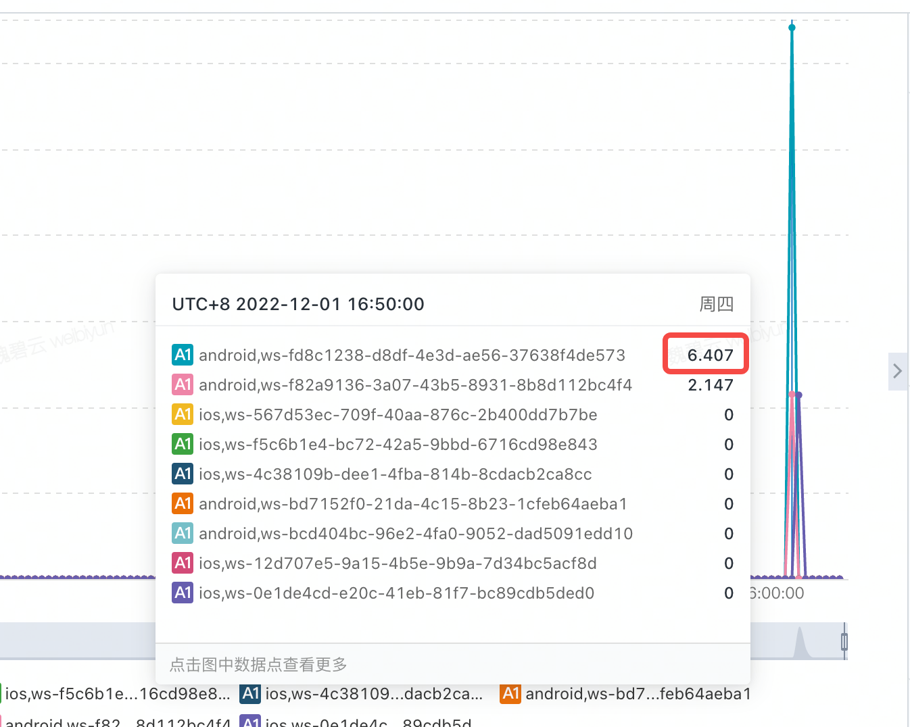
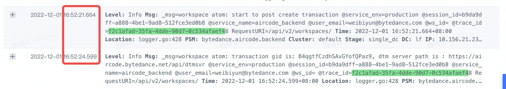

- DONE 上线 bits MR 创建耗时优化
	- TODO 观察数据
		- 发现 android 有些数据要 6/7s，那是因为预热资源比较多，现在获取预热资源的逻辑有问题，下周上新的服务之后就没有这个问题了
		- 发现 命中预创建的 create 也有一个是 6s 耗时
			- 
			- 分析：这里差不多花了 3s 的时间
				- 
				-
- DONE 跨域名问题排查
	- https://juejin.cn/post/6987205879653204004
- TODO  整理 bits mr 有价值的文档
	- 方案
	- 指标
-