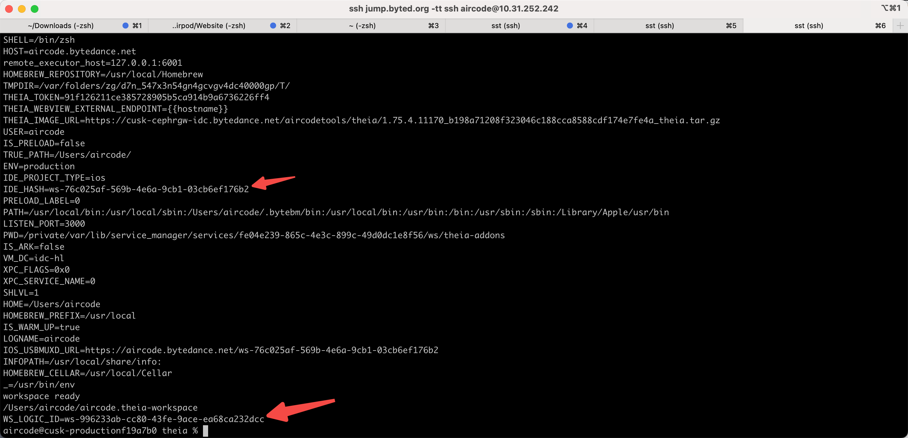

- 两个问题
	- 1. 命中预创建盘之后卡在 theia probe （偶现）
	  2. TTIOS warmup 成功之后是不是没有 report-preload
	  3. 预创建首次创建的逻辑 id 是预创建的
	   
-
- DONE 将创建预创建盘的逻辑改一改
	- DONE materials 服务还是返回 wsid，存储的时候也是存 wsid
	- DONE backend 服务改为获取 wsid，存储wsid
	- DONE backend 获取到 wsid 之后从 workspace 中获取到 volumeid
	- DONE 创建完盘之后不删除 workspace 和 volume，其他都删掉
	- DONE 删除的时候也应该从 workspace 中获取 volume，删掉 workspace 和 volume
	-
-
- DONE ignore repo 有问题
	- 并发问题
-
- DONE 创建优化发版
	- products 添加 group_name 字段
	- 发布 backend
	- 更新 products