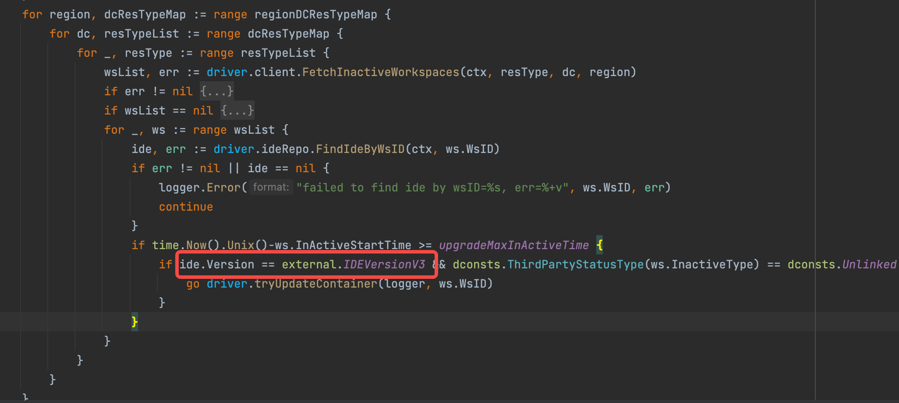

- TODO TTIOS warmup 成功之后是不是没有 report-preload
	- 检查  dtm，检查是否太长时间没有将 materials 状态改为 1，导致被删除
- TODO 修改代码 通过 store 取
- TODO airpod 前端
	- DONE 子路由，获取路由上的 tid 和 wsid
	- 滚屏更新
- TODO 检查一下有没有针对 v3 的操作
	- 
-
- DONE 给 shenquan 更新一下 workpace 的脚本