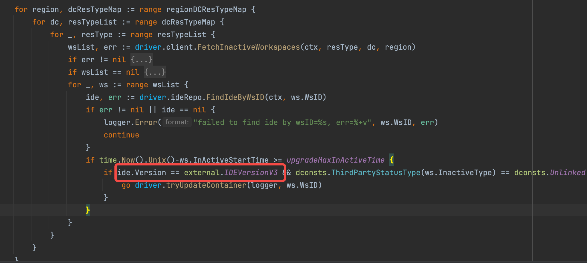

- TODO TTIOS warmup 成功之后是不是没有 report-preload
	- 检查  dtm，检查是否太长时间没有将 materials 状态改为 1，导致被删除
- TODO 修改代码 通过 store 取状态（hotfix/store）
- DONE 检查一下有没有针对 v3 的操作
  collapsed:: true
	- 
- DONE 修复 v4 工作区 afp 目录被覆盖的问题 (hotfix/mount-afp)
- TODO fix 修复命中不同资源（预热/盘）时对 logic 和 resource 的处理 （hotfix/volume-warmup-hit）
	- DONE AttachVolume 只执行了 start
	- DONE 昨天测了一下，命中之后的工作区状态除了一个 creating 的 phase 啥也没有 (这个是因为 creating 直接取的 workspace 的 matchlabel 匹配的，应该取 resource id)
		- 
-
- DONE  airpod log 联调
- DONE 命中预热 /user/aircode 以及 不命中预热 /volume/data ，统一路径
	- 于洋下周二加上
-
-