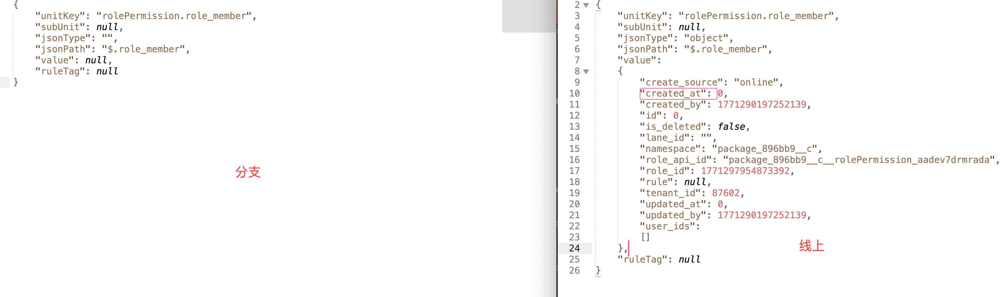
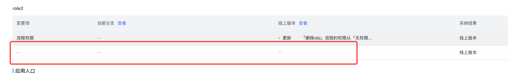

-
- 这个有问题啊，如果我在某个分支上面增加了成员，然后有马上将成员删了，这个时候就会出现问题。因为这个时候会创建一条 roleMember 的记录，然后发布上线，线上也会有一条 roleMember 的记录，但实际上这个 roleMember 是没有数据的，所以这个时候跟没有记录是一样的。这个时候如果切换到其他的分支（这个分支没有创建过 roleMember），此时这个分支是没有 roleMember 记录的，此时查看线上和分支之间的 diff，会有一条空的 roleMember。这是因为线上和分支 export 出的数据是不同的，就是因为我们导出的时候回去获取 roleMember 数据，线上有记录所以有数据，分支没记录，所以没数据。。。  于是就出现了 diff
	- 
	- 
-