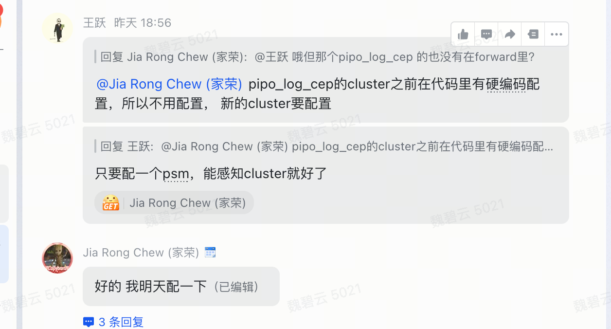

- DONE 刷 my 的脚本 & 注册转发
- DONE 检查 tcc 和 fg 的 diff
	- DONE tcc
	  collapsed:: true
		- DONE log_subscribe_rate_limit_msg_conf 
		   function_error_alarm 
		   mario_conf 
		   common_sdk_version
		- DONE argos_log_forward_secret_key
		  cloud_service_account_secret
		  function_log_download
		  microservice_config
		  serverless_faas_access_type
		  faas_trigger_body_limit
		  faas_larkcloud_timeout
		  faas_debug_resource_pool
		  faas_gray_control_conf
		  faas_org_conf
		  faas_sdk_linkage
		  template_version_conf
		  papi_header_config
		  faas_call_api_timeout
		  ve_current_apig_conf
		  serverless_framework_conf
		  serverless_exec_code_config
		  serverless_faas_resource_pool_conf
		  serverless_template_version_conf
		  serverless_encrypt_conf
		  serverless_faas_resource_config
		  public_api_offline_conf
		  mario_conf
	- DONE fg
	  collapsed:: true
		- | apaas.lowcode.disable_publish_temp_online |
- TODO 测试 sg bytefaas 日志和长任务 callback
	- 长任务 callback 测不了，现在流量都在 my，域名也是直接转发到了 my，callback 通过 openAPI 的域名访问的，没办法测试到 sg
	- bytefaas 日志延迟降下来了，但是还需要做一些配置 
-
-
-