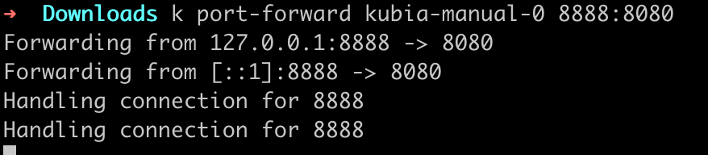

- ## 创建、运行及共享容器镜像
	- ### 先创建一个服务
		- ```js
		  const http = require('http');
		  const os = require('os');
		  
		  console.log("kubia server starting...");
		  
		  var handler = function(req, res){
		  	console.log("received req from " + req.connection.remoteAddress);
		  	res.writeHead(200);
		  	res.end("you've hit "+ os.hostname + "\n");
		  };
		  
		  var www = http.createServer(handler);
		  www.listen(8080)
		  ```
		-
	- ### Dockerfile
		- ```bash
		  FROM node:12					# 使用的 node 镜像的 tag 12 版本
		  ADD app.js /app.js				# 把 app.js 文件从本地文件夹添加到镜像的根目录，保持 app.js 文件名
		  ENTRYPOINT ["node", "app.js"]	# 订阅了当镜像被运行时需要被执行的指令，在这里就是 node app.js
		  ```
		-
	- ### docker build 将服务打包成一个镜像
		- ```bash
		  # 会编译 Dockerfile
		  docker build -t kubia .
		  ```
		-
		-
	- ### 在容器中运行该镜像
		- ```bash
		  # 直接运行该镜像
		  docker run kubia
		  
		  # 创建一个新容器来运行该镜像
		  docker run --name kubia-container -p 8080:8080 -d kubia
		  	# 这条指令告知 Docker 基于 kubia 镜像创建一个叫 kubia-container 的新容器
		      # 这个容器与命令行分离（-d 标志），意味着在后台运行。
		      # 本机的 8080 端口会被映射到容器内的 8080 端口
		  ```
		- #problem #docker 设置了端口映射之后为啥映射方式是 <b>0.0.0.0:60933->8080/tcp</b>
		-
		- 如果没有在本机上运行 Docker 守护进程（比如使用 Max 或 Windows 系统，守护进程会运行在 VM 中），需要使用 VM 的主机名或 IP 代替 localhost
		- {:height 370, :width 637}
		- 我们可以进入到该容器中查看信息：
			- {:height 283, :width 662}
		-
		- 直接运行 docker run image 和自定义一个新容器来运行 image 的区别是：
			- 如果直接使用 docker run image，那么此时 docker 会自动帮我们创建一个容器来运行这个 image
	-
	- ### 访问应用
		- ```bash
		  curl 0.0.0.0:60933
		  ```
			- {:height 48, :width 213}
	-
	- ### 停止和删除容器
		- ```
		  docker stop kubia-container
		  
		  docker rm kubia-container
		  ```
	-
	- ### 其他常用指令
		- ```bash
		  # 打 tag
		  docker tag kubia tagName
		  
		  # 将镜像推到镜像仓库
		  docker push image
		  
		  # 拉取镜像
		  dokcer pull image
		  ```
		-
		- 在 push 的时候可能会报错，这是因为我们还没有登录到 docker，我们需要在 [docker hub](https://hub.docker.com/repositories) 先注册，然后通过 `docker login` 进行登录
			- 我们需要在 [docker hub](https://hub.docker.com/repositories) 创建一个自己的 repository，假如我的命名为 weibiyun/kubia，那么我们在给镜像打 tag 的时候也要打成 weibiyun/kubia 的形式，这样我们才能将该镜像上传到我们的仓库
-
- ## 配置 Kubernetes 集群
	- 我们这里使用 minikube 进行学习
		- ```bash
		  minikube ip # 现实 minikube 虚拟机的 ip
		  ```
	- minikube 不支持 LoadBalancer 类型的服务，因此服务不会有外部 IP。但是可以通过外部端口访问服务。可以运行 minikube service kubia-http 获取可以访问服务的 IP 和端口
	-
	- ### 创建 pod
		- 有两种创建 pod 的方式，一种是直接通过命令行创建（这种不能自定义配置），一种是通过 yaml/json 文件创建
		- ```bash
		  # 第一种，只会创建一个 pod
		  k run kubia --image=weibiyun/kubia --port=8080
		  	# --image=weibiyun/kubia: 表示要运行的容器惊喜那个
		      # --port=8080: 告诉 Kubernetes 应用正在监听 8080 端口
		      
		  # 第二种，会创建 statefulsets
		  k create -f kubuia.yaml
		  	# 从 yaml 文件创建 pod
		      # -f 表示从 yaml/json 创建任何资源，不只是 pod
		  ```
		- {:height 49, :width 433}
		- {:height 174, :width 655}
		-
	- ### 查看应用程序日志
		- 通过下面的命令可以获取**容器**的日志：
		- ```bash
		  docker logs <container id>
		  ```
		- 使用 ssh 命令登录到 pod 正在运行的节点，并使用 docker logs 命令查看其日志
		-
		- kubectl logs 获取 **pod** 日志
		- ```bash
		  k logs website2-0
		  ```
		-
		- 获取多容器 pod 的日志时指定容器名称
		- ```bash
		  k logs kubia-manual -c kubia
		  	# -c 表示哪个 container
		  ```
	-
	- ### 向 pod 发送请求
		- 这里我们不使用暴露 service 的方式来与 pod 通信，后面再进行这个操作，本次测试通过 <ins>端口转发</ins> 的方式进行测试
		- kubenetes 运行我们配置端口转发到该 pod。可通过 kubectl port-forward 命令完成操作。例如下面命令会将机器的本地端口 8888 转发到我们的 kubia-manual pod 的端口 8080
		- ```bash
		  k port-forward kubia-manual-0 8888:8080
		  ```
		- {:height 72, :width 482}
		- 此时我们可以通过 curl 发送消息给 pod
			- ```bash
			  curl localhost:8888
			  ```
			- {:height 53, :width 298}
			- {:height 79, :width 418}
		-
		- 下图展示了发送请求时的简化视图
		- {:height 180, :width 573}
		-
	- ### 使用标签组织 pod
		- 未来我们系统中如果有数百个 pod，如果没有可以有效组织这些组件的机制，将会导致巨大的混乱，因此我们可以给这些 pod 打标签，通过标签来组织 **pod** 和所有**其他 Kubernetes 对象**（包括 node/service/ingress）
		- 我们之后也可以通过标签选择器来选择指定的 pod，比如我们 aircode 中就设置了 app=wsid，选择的时候可通过 app 来选择特定的 pod
		- 操作标签的方式：
			- ```bash
			  # 添加标签
			  k label po kubia-manual test=label1
			  
			  # 修改标签
			  k label po kubia-manual test=label2 --overwrite
			  
			  # 查看标签
			  k get po --show-labels
			  
			  # 查看指定标签
			  k get po -L test
			  ```
		-
		- 通过标签选择器列出 pod
			- ```bash
			  # 列出所有 test=label1 的标签
			  k get po -l test=label1
			  
			  # 列出所有包含 test 的 pod
			  k get po -l test
			  
			  # 列出所有不包含 test 的 pod。⚠️注意，必须使用单引号
			  k get po -l '!test'
			  ```
	-
	- ### 使用标签和选择器来约束 pod 调度
		- 之前我们有说到 labels 可以用来组织所有 Kubernetes 对象，那么我们也可以用来组织 node。
		- 我们现在想要将 pod 调度到某组节点上，我们可以先给 node 打标签，然后在 pod 的 yaml 文件中设置 nodeSelector 来表明我们要将该 pod 调度到哪组 node 上。
		- {:height 192, :width 423}
		- #problem 这里使用 nodeSelector 将节点调度到指定 node 上，突然想到我们 iOS 的 node 也应该要调度到特定节点（vk）上，然后查看了一下并不是使用 nodeSelector 实现的，感觉像是指定的 nodeName？这里要确认一下
			- {:height 84, :width 343}
			-
	- ### 注解 pod（annotation）
		- 除了标签外， pod 和其他对象还可以包含**注解**。结构上与标签非常相似，不过与标签的意义不同，注解并不是为了保存标识信息而存在的，它们不能像标签一样用于对对象进行分组。
		- ```bash
		  # 向一个已经存在的 pod 中添加注解
		  k annotate po kubia-manual-0 cusk_vm_xcode="Xcode-13.2"
		  ```
		-
-
- ## 使用命名空间对资源进行分组
	- 命名空间也是一种 Kubernetes 资源
	- 命名空间简单地为对象提供了一个作用域（注意，这个与我们前面提到的 Linux 的命名空间不同）
	- <ins>命名空间的使用需求：</ins> 在使用多个 namespace 的前提下，我们可以将包含大量组件的复杂系统拆分成更小的不同组，这些不同组也可以用于在多租户环境中分配资源，将资源分配为生产、开发和QA环境
		- 在咱们的项目中就有使用 ide namespace 来标识所有的 ide workspace
	- ##
	- ### 从 yaml 文件创建命名空间
		- ```yaml
		  apiVersion: v1
		  kind: Namespace
		  metadata:
		  	name: custom-namespace
		  ```
		- `k create -f custom-namespace.yaml` 进行创建 namespace 资源
		-
	- ### 直接使用 `k create namespace` 创建命名空间
		- ```bash
		  k create namespace kubia-namespace
		  ```
		-
	- ### 管理其他命名空间中的对象
		- 之前我们创建的 pod 都是属于默认的命名空间的，我们可以给这些资源设置自定义的命名空间，有两种方式可以设置
			- 第一种，直接修改 metadata 中的 namespace 字段的内容
			- 第二种，再创建的时候指定命名空间
				- ```bash
				  k create -f kubia-manual.yaml -n custom-namespace
				  ```
		-
		- 一旦给资源指定了命名空间，那么我们在查看资源信息的时候就要加上相应的 namespace 进行筛选，如果不加则表示查看默认资源
			- ```bash
			  k get po -n custom-namspace
			  ```
			- {:height 68, :width 475}
	-
	- ### 命名空间中的隔离
		- 命名空间将对象分隔到不同的组，只允许对属于特定命名空间的对象进行操作，但实际上命名空间之间并不提供对正在运行的对象的任何隔离
		- 问：不同命名空间中的 pod 能否进行通信？
			- 可以。命名空间之间是否提供网络隔离取决于 Kubernetes 所使用的网络解决方案。当该方案不提供命名空间之间的网络隔离时，如果命名空间 foo 中的某个 pod 知道命名空间 bar 中 pod 的 IP 地址，那它就可以将流量（如 HTTP 请求）发送到另一个 pod。
	-
	- ### 停止和移除 pod
		- 我们有多种方式删除 pod
			- 按名称
				- ```bash
				  k delete op kubia-manual
				  ```
			- 通过标签选择器
				- ```bash
				  k delete po -l test=label1
				  ```
			- 通过删除整个命名空间来删除：可以简单删除整个命名空间，pod 将会伴随命名空间自动删除
				- ```bash
				  k delete ns custom-namespace
				  ```
			- 删除命名空间中的所有 pod，但保留命名空间
				- ```bash
				  k delete po --all
				  ```
			- 删除命名空间中的（几乎）所有资源
				- ```bash
				  k delete all --all
				  	# 第一个 all 指定正在删除所有【资源类型】
				      # --all 指定将删除所有资源实例
				  ```
				- `k delete all -all` 命令也会删除 Kubernetes 的 service，但它应该会在几分钟后自动重创
				-