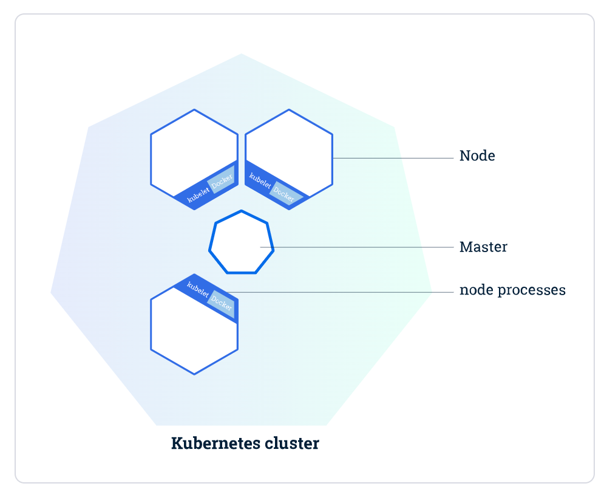
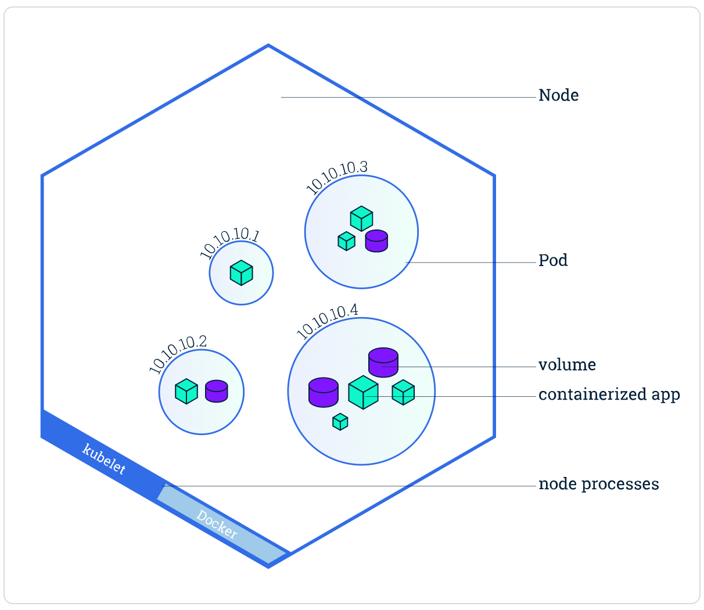
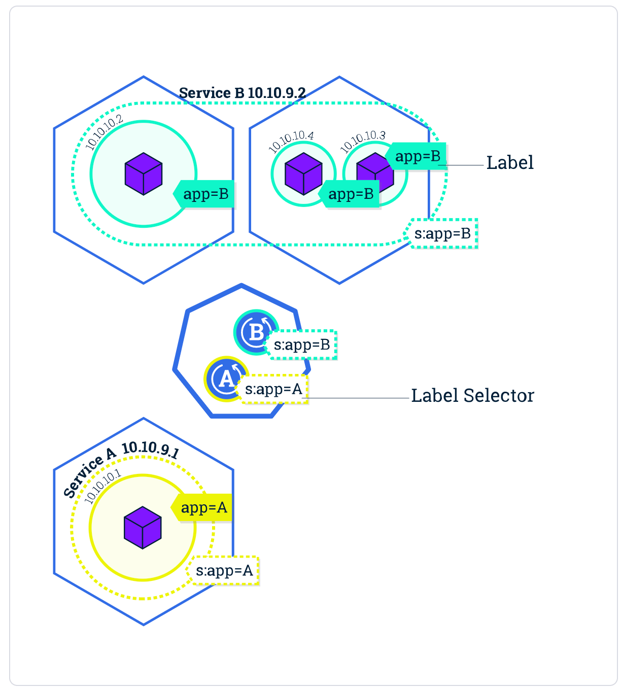

- Kubernetes 由 一个 **主节点** 和 **几个工作节点** 组成，如下图，中间的就是一个 Master 节点，旁边围着的就是 worker 节点
	- **Master 负责管理集群** 负责协调集群中的所有活动，例如调度应用程序，维护应用程序的状态，扩展和更新应用程序。
	- **Worker节点(即图中的Node)是VM(虚拟机)或物理计算机，充当k8s集群中的工作计算机**。 每个Worker节点都有一个Kubelet，它管理该Worker节点并负责与Master节点通信。该Worker节点还应具有用于处理容器操作的工具，例如Docker。
	- {:height 225, :width 282}
-
- ## Pod
- Pod（容器组）总是在 Node（节点） 上运行。Node（节点）是 kubernetes 集群中的计算机，可以是虚拟机或物理机。
	- 最外层的六边形是一个 node
	- 里面的每个圈圈是一个 pod
		- Pod 容器组 是一个k8s中一个抽象的概念，用于存放一组 container（可包含一个或多个 container 容器，即图上正方体)，以及这些 container （容器）的一些共享资源。这些资源包括：
			- 共享存储，称为卷(Volumes)，即图中紫色圆柱
			- 网络，每个 Pod（容器组）在集群中有个唯一的 IP，pod（容器组）中的 container（容器）共享该IP地址
			- container（容器）的基本信息，例如容器的镜像版本，对外暴露的端口等
		-
		- Pod 是 Kubernetes 平台上的**原子单元**，当我们在 Kubernetes 上创建 Deployment 时，该 Deployment 会在其中创建包含容器的 Pod（而不是直接创建容器）
		-
		- 每个 Kubernetes 工作节点至少运行:
			- Kubelet，负责 Kubernetes 主节点和工作节点之间通信的过程; 它管理 Pod 和机器上运行的容器。
			- 容器运行时（如 Docker）负责从仓库中提取容器镜像，解压缩容器以及运行应用程序。
	- {:height 220, :width 330}
-
- ## Kubernetes Service（服务）概述
	- 一个 Service（服务）选定哪些 Pod（容器组） 通常由 LabelSelector(标签选择器) 来决定。
	- 查看后端的代码可以看到，labels 通常等于 deploy.Spec.Selector.MatchLabels，我们查看一下 nginx Deployment 创建的服务的文件，可以 spec - selector - matchLabels 定义。
		- ```yaml
		  # nginx-service.yaml
		  apiVersion: v1
		  kind: Service
		  metadata:
		    name: nginx-service	#Service 的名称
		    labels:     	#Service 自己的标签
		      app: nginx	#为该 Service 设置 key 为 app，value 为 nginx 的标签
		  spec:	    #这是关于该 Service 的定义，描述了 Service 如何选择 Pod，如何被访问
		    selector:	    #标签选择器
		      app: nginx	#选择包含标签 app:nginx 的 Pod
		    ports:
		    - name: nginx-port	#端口的名字
		      protocol: TCP	    #协议类型 TCP/UDP
		      port: 80	        #集群内的其他容器组可通过 80 端口访问 Service
		      nodePort: 32600   #通过任意节点的 32600 端口访问 Service
		      targetPort: 80	#将请求转发到匹配 Pod 的 80 端口
		    type: NodePort	#Serive的类型，ClusterIP/NodePort/LoaderBalancer
		  
		  ```
	-
	- LabelSelector & Labels
		- LabelSelector 是一个标签选择器，我们在配置 deployment 的时候会设置其标签选择器，如下 deployment B 设置了标签选择器 app=B
		- 通过 deployment B 创建的 pod 都会带上 app=B 这个标签
		- Service B 通过标签选择器 app=B 选择可以路由的 Pod
		- {:height 220, :width 330}
		-
		- .spec.selector 必须匹配 .spec.template.metadata.labels，否则请求会被 API 拒绝。