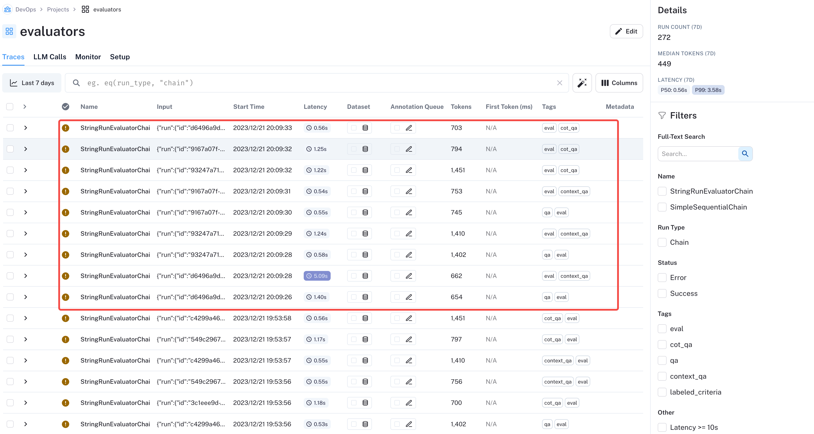

- > LangSmith 是一个用于构建生产级 LLM 应用程序的平台。它可以让您**调试、测试、评估和监控**基于任何LLM框架构建的链和智能代理，并与LangChain无缝集成，LangChain是使用LLM构建的首选开源框架。
-
- ## 产品简介
- [产品链接](https://smith.langchain.com/o/c20fb87c-574c-443e-8be0-3e221d10f817/projects)
- 产品页面：
- 
	-
	- Projects：我们可以在 Projects tab 页面，创建一个新的 project，如 `test_wby` 。我们在跑任务的时候，可以指定 **LANGCHAIN_PROJECT**，那么执行的链路就会落到我们的这个 project 上。
	- Annotation Queues：
	- Deployments：
	- Datasets & Testing：
-
-
- ## Tracing
- ### 代码演示
  collapsed:: true
	- ```python
	  import os
	  from langchain.chains import SimpleSequentialChain, LLMChain
	  from langchain.chat_models import AzureChatOpenAI
	  from langchain.smith import run_on_dataset, RunEvalConfig
	  from langchain_core.prompts import PromptTemplate
	  from langsmith import Client
	  
	  BASE_URL = "https://search.bytedance.net/gpt/openapi/online/v2/crawl"
	  API_KEY = "DU9jtCXj6nfBDlG5eionL6j66Q7awkgO" # 填入公司申请的 LLM key
	  DEPLOYMENT_NAME = "gpt-35-turbo-0613"  # 对应的模型名称，支持的模型有：gpt-35-turbo、gpt-35-turbo-16k、gpt-4、gpt-4-32k等 chat 模型
	  
	  os.environ["LANGCHAIN_TRACING_V2"] = 'true'
	  os.environ["OPENAI_API_KEY"] = API_KEY
	  os.environ["LANGCHAIN_API_KEY"] = 'ls__958bd710d37540ef9cef7cdd9110d0d2'
	  os.environ["LANGCHAIN_ENDPOINT"] = "https://api.smith.langchain.com"
	  os.environ["LANGCHAIN_PROJECT"] = 'test_wby'
	  
	  
	  def baseConfig():
	      llmqw = AzureChatOpenAI(
	          openai_api_base=BASE_URL,
	          openai_api_version="2023-03-15-preview",
	          deployment_name=DEPLOYMENT_NAME,
	          openai_api_key=API_KEY,
	          openai_api_type="azure",
	          temperature=0
	      )
	  
	      template = """你的工作是从用户建议的地区想出一道经典菜肴。
	          % USER LOCATION
	          {user_location}
	  
	          你的回答:
	          """
	      prompt_template = PromptTemplate(input_variables=["user_location"], template=template)
	      location_chain = LLMChain(llm=llmqw, prompt=prompt_template)
	  
	      # meal 链
	      template = """ 给定一道菜，提供一个简短而简单的食谱，教你如何在家里做这道菜。
	          % MEAL
	          {user_meal}
	  
	          你的回答:
	          """
	  
	      prompt_template = PromptTemplate(input_variables=["user_meal"], template=template)
	      meal_chain = LLMChain(llm=llmqw, prompt=prompt_template)
	  
	      # 通过 SimpleSequentialChain 串联起来，第一个答案会被替换第二个中的user_meal，然后再进行询问
	      overall_chain = SimpleSequentialChain(chains=[location_chain, meal_chain], verbose=True)
	      return overall_chain
	  
	  
	  def run_chain():
	      overall_chain = baseConfig()
	      review = overall_chain.run("新疆")
	      print(review)
	  
	  if __name__ == '__main__':
	      run_evaluation()
	      # run_chain()
	  ```
-
- ### 结果展示
  collapsed:: true
	- 在我们创建的 Projects 中会展示运行链路和结果
	- 
	- {:height 483, :width 780}
	-
-
- ---
- ## Datasets
- > datasets 给我的感觉就是，我们可以在 datasets 中添加 input 和 output 的 example，后续可以利用这个 datasets 的数据来做模型的评估。可以把这个 datasets 看作是自定义的验证集
-
- LangSmith 支持三种 datasets
	- kv
	- llm
	- chat
-
- ---
- ## Testing & Evaluation
- > 做测试和评估的基础：
  1. 需要构建数据集（?）
  2. 使用 `run_on_datasets`/ `client.evaluate_run(run_id, run_evaluator)`方法在我们构建的数据集上测试
- > 评估包括 LangChain 原生的评估方式，也可以自定义评估方式
-
- ### 代码演示
  collapsed:: true
	- ```python
	  import os
	  from langchain.chains import SimpleSequentialChain, LLMChain
	  from langchain.chat_models import AzureChatOpenAI
	  from langchain.smith import run_on_dataset, RunEvalConfig
	  from langchain_core.prompts import PromptTemplate
	  from langsmith import Client
	  
	  BASE_URL = "https://search.bytedance.net/gpt/openapi/online/v2/crawl"
	  API_KEY = "DU9jtCXj6nfBDlG5eionL6j66Q7awkgO" # 填入公司申请的 LLM key
	  DEPLOYMENT_NAME = "gpt-35-turbo-0613"  # 对应的模型名称，支持的模型有：gpt-35-turbo、gpt-35-turbo-16k、gpt-4、gpt-4-32k等 chat 模型
	  
	  # 环境变量配置
	  os.environ["LANGCHAIN_TRACING_V2"] = 'true'
	  os.environ["OPENAI_API_KEY"] = API_KEY
	  os.environ["LANGCHAIN_API_KEY"] = 'ls__958bd710d37540ef9cef7cdd9110d0d2'
	  os.environ["LANGCHAIN_ENDPOINT"] = "https://api.smith.langchain.com"
	  os.environ["LANGCHAIN_PROJECT"] = 'test_wby'	# project
	  
	  
	  def baseConfig():
	      llmqw = AzureChatOpenAI(
	          openai_api_base=BASE_URL,
	          openai_api_version="2023-03-15-preview",
	          deployment_name=DEPLOYMENT_NAME,
	          openai_api_key=API_KEY,
	          openai_api_type="azure",
	          temperature=0
	      )
	  
	      template = """你的工作是从用户建议的地区想出一道经典菜肴。
	          % USER LOCATION
	          {user_location}
	  
	          你的回答:
	          """
	      prompt_template = PromptTemplate(input_variables=["user_location"], template=template)
	      location_chain = LLMChain(llm=llmqw, prompt=prompt_template)
	  
	      # meal 链
	      template = """ 给定一道菜，提供一个简短而简单的食谱，教你如何在家里做这道菜。
	          % MEAL
	          {user_meal}
	  
	          你的回答:
	          """
	  
	      prompt_template = PromptTemplate(input_variables=["user_meal"], template=template)
	      meal_chain = LLMChain(llm=llmqw, prompt=prompt_template)
	  
	      # 通过 SimpleSequentialChain 串联起来，第一个答案会被替换第二个中的user_meal，然后再进行询问
	      overall_chain = SimpleSequentialChain(chains=[location_chain, meal_chain], verbose=True)
	      return overall_chain
	  
	  def run_evaluation():
	      overall_chain = baseConfig()
	      evaluation_config = RunEvalConfig(
	          evaluators=[
	              "qa",
	              "context_qa",
	              "cot_qa",
	          ]
	      )
	  
	      client = Client()
	      run_on_dataset(
	          dataset_name="test_wby_database",    # 数据集名称
	          llm_or_chain_factory=overall_chain,
	          client=client,
	          evaluation=evaluation_config,
	          project_name="test_05",     # 使用新的 project_name，或者把远端生成的删了(⚠️注意：不同数据集，project_name 也不能相同)
	      )
	  
	  if __name__ == '__main__':
	      run_evaluation()
	      # run_chain()
	  ```
-
- ### 结果展示
  collapsed:: true
	- 评估 `test_wby_database` 数据集中的数据，运行结果名为 `test_05`
		- 
	-
	- 评估的 trace 可以在 `Projects -> evaluators` 中看到，进入到 `evaluators -> Traces` 可以看到评估结果，由于我们在代码中配置了三种评估指标：`qa` / `cot_qa` / `context_qa`，并且数据集中又三个 example，因此评估 traces 有 3*3=9 个结果。
		- {:height 297, :width 749}
		- 
		-
-
- ---
- ## Feedback
- > feedback 包括两种：自动和人工。
  1. 自动 feedback 可以通过调用`run_on_datasets`/ `client.evaluate_run(run_id, run_evaluator)`方法
  2. 人工 feedback 有两种方式：点击 `Rate Run` 或者使用 LangSmith client (或者 RestAPI)
-
-