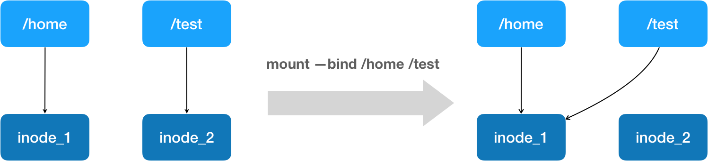

- bind mount：指 Linux 的绑定挂载机制。
	- 它的主要**作用**就是，允许你将一个目录或者文件，而不是整个设备，挂载到一个指定的目录上。并且，这时你在该挂载点上进行的任何操作，只是发生在被挂载的目录或者文件上，而原挂载点的内容则会被隐藏起来且不受影响。
	-
- 绑定挂载实际上是一个 inode 替换的过程。在 Linux 操作系统中，inode 可以理解为存放文件内容的“对象”，而 dentry，也叫目录项，就是访问这个 inode 所使用的“指针”。
	- {:height 165, :width 545}
	- mount --bind /home /test，会将 /home 挂载到 /test 上。/test 就是挂载点，而/home 就是被挂载点，我们在 /test 上做的任何操作都会发生在 /home 上。
-
- **所以，在一个正确的时机，进行一次绑定挂载，Docker 就可以成功地将一个宿主机上的目录或文件，不动声色地挂载到容器中。**
-