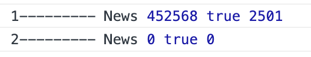
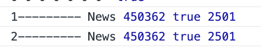

- useCallback
	- 这个讲的挺好的： [useCallback 基础用法](https://github.com/puxiao/react-hook-tutorial/blob/master/10%20useCallback%E5%9F%BA%E7%A1%80%E7%94%A8%E6%B3%95.md)
	- 关于这个 hook，我自己的理解是：当一个父组件中有多个相同的子组件的时候，如果不想某个子组件的修改影响到其他子组件，那么就可以使用 useCallback
	-
- 一个坑
	- 在 setInterval 外部获取到的状态是最新的，但是在 setInterval 内部获取到的是旧的
		- 这个因为在 setInterval 中有一份 alreadyHave 的拷贝，也就是说 setInterval 中的函数声明的时候，因为用到了外部变量，所以会 binding 声明时的值
		- ```js
		  import { useEffect, useState } from 'react';
		  import { GET_IDE_LOG } from '../../../../network/api';
		  import { selectDebug, setLogInfo } from '../../../../reducers/debug';
		  import { useAppDispatch, useAppSelector } from '../../../../store/hooks';
		  import { IDebugProps } from './DebugInfo';
		  
		  const useDebugInfoModal = (props: IDebugProps) => {
		    const { visibleLog, visibleIDEDetailes } = props;
		    const debug = useAppSelector(selectDebug);
		    const dispatch = useAppDispatch();
		    const { logInfo, id, wsName } = debug;
		    const { logData, alreadyHave } = logInfo;
		    // 这里打印的状态都是最新的
		    console.log(
		      '1---------',
		      wsName,
		      logInfo.logData.length,
		      visibleLog,
		      logInfo.alreadyHave
		    );
		  
		    const [refresh, setRefresh] = useState(false);
		    useEffect(() => {
		      if (visibleLog) {
		        // 发现一个问题，如果我不刷新这个页面，那么我获取到的 alreadyHave 使用是刚进入该页面时候的值
		        // 也就是说，如果将下面的方法包在一个 setInterval 中的话，alreadyHave 是不会变的
		        setInterval(() => {
		  	    // 这里打印的状态是初始值
		          console.log(
		            '2---------',
		            wsName,
		            logInfo.logData.length,
		            visibleLog,
		            logInfo.alreadyHave
		          );
		          GET_IDE_LOG(id, alreadyHave)
		            .then((res) => {
		              // 这里更新状态
		              dispatch(setLogInfo(logData + res.data.log));
		            })
		            .catch((e) => console.log(e));
		        }, 5000);
		      }
		    }, [visibleLog]);
		  
		    return {
		      wsName,
		      logData
		    };
		  };
		  
		  export default useDebugInfoModal;
		  
		  ```
		- {:height 106, :width 528}
		-
		- 可以利用 useRef 进行修改，在 useEffect 上面添加
		- ```js
		  const ref = useRef(alreadyHave)
		  ref.current = alreadyHave
		  ```
		-
	- 这里是不是因为我们第一次进入 useEffect 的时候捕获的是一个初始值，之后就进入了 setInterval 中，然后 setInterval 中的值页是 useEffect 的值，后续由于不会更新 useEffect 所以导致 setInterval 中的值也没有发生改变？会出现这种情况吗？ setInterval 会把这个值给固定住？
	-
	- 将上面的代码改写成如下形式就没问题了
		- ```
		  import { useEffect, useState } from 'react';
		  import { GET_IDE_LOG } from '../../../../network/api';
		  import { selectDebug, setLogInfo } from '../../../../reducers/debug';
		  import { useAppDispatch, useAppSelector } from '../../../../store/hooks';
		  import { IDebugProps } from './DebugInfo';
		  
		  const useDebugInfoModal = (props: IDebugProps) => {
		    const { visibleLog, visibleIDEDetailes } = props;
		    const debug = useAppSelector(selectDebug);
		    const dispatch = useAppDispatch();
		    const { logInfo, id, wsName } = debug;
		    const { logData, alreadyHave } = logInfo;
		    console.log(
		      '1---------',
		      wsName,
		      logInfo.logData.length,
		      visibleLog,
		      logInfo.alreadyHave
		    );
		  
		    const [refresh, setRefresh] = useState(false);
		    useEffect(() => {
		      if (visibleLog) {
		        // 发现一个问题，如果我不刷新这个页面，那么我获取到的 alreadyHave 使用是刚进入该页面时候的值
		        // 也就是说，如果将下面的方法包在一个 setInterval 中的话，alreadyHave 是不会变的
		        console.log(
		          '2---------',
		          wsName,
		          logInfo.logData.length,
		          visibleLog,
		          logInfo.alreadyHave
		        );
		        GET_IDE_LOG(id, alreadyHave)
		          .then((res) => {
		            console.log(res);
		            dispatch(setLogInfo(logData + res.data.log));
		            setTimeout(() => {
		              setRefresh(!refresh);  // 利用 refresh 来刷新页面
		            }, 5000);
		          })
		          .catch((e) => console.log(e));
		      }
		    }, [visibleLog, refresh]);
		  
		    return {
		      wsName,
		      logData
		    };
		  };
		  
		  export default useDebugInfoModal;
		  
		  ```
		- 
		-