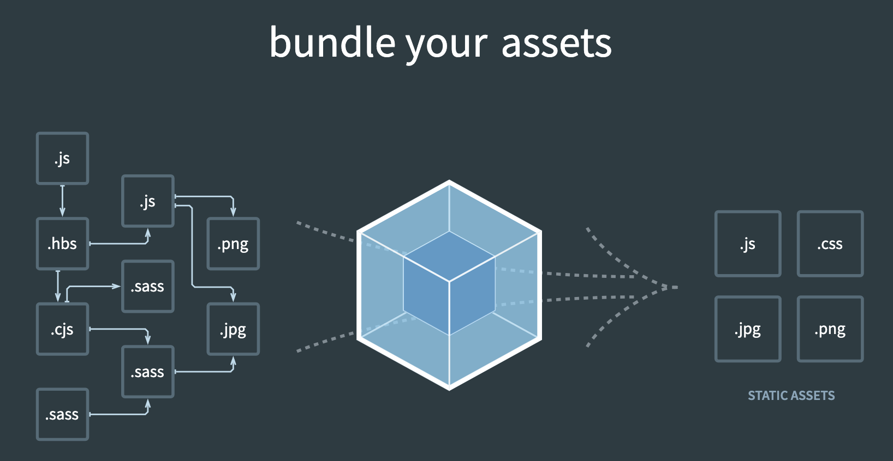

- webpack is a **static module bundler** for modern JavaScript applications
	- webpack 实际上就是一个打包模块，将各种类型的资源，包括图片、css、js 等，转译、组合、拼接、生成 JS 格式的 bundler 文件。 [官网首页](https://webpack.js.org/)的动画很形象地表达了这一点
	- 
	-
	- 这个过程实际上包含三个阶段：
		- 初始化阶段
		- 构建阶段
		- 生成阶段
-
- Webpack 编译过程会将源码解析为 AST 吗？webpack 与 babel 分别实现了什么？
	- 构建阶段会读取源码，解析为 AST 集合。
	- Webpack 读出 AST 之后仅遍历 AST 集合；babel 则对源码做等价转换
- Webpack 编译过程中，如何识别资源对其他资源的依赖？
	- Webpack 遍历 AST 集合过程中，识别 require/ import 之类的导入语句，确定模块对其他资源的依赖关系
- 相对于 grant、gulp 等流式构建工具，为什么 webpack 会被认为是新一代的构建工具？
	- Grant、Gulp 仅执行开发者预定义的任务流；而 webpack 则深入处理资源的内容，功能上更强大
-