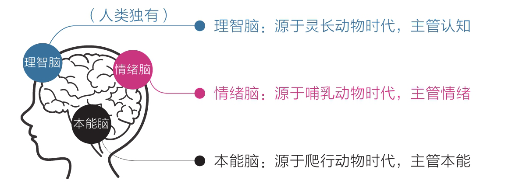
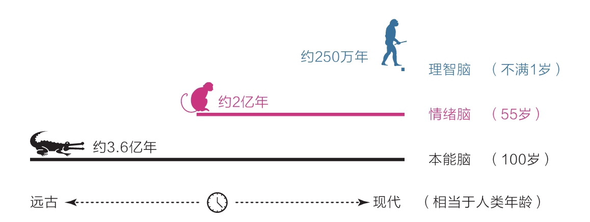

- 不知道大家会不会遇到这样的问题，就是我明明知道应该怎么做，但是就是不愿意去做。比如我知道熬夜不好应该早点睡，但是每天晚上还是捧着手机玩到深夜；又或者明明知道做久了应该起来活动活动，但依旧在凳子上不愿意起来。
- 之前我只是意识到我有这个问题，但是产生这个问题的原因是什么我并不知道，当一件事我找不到原因的时候我就无法说服自己去修正，即使知道是错的，但是也会去做。当我读到这本书的时候突然有种豁然开朗的感觉。
-
- ## 大脑——一切问题的起源
- 从大脑的结构来分析我们的行为
	- 作者将大脑的三个系统用三个比较通俗的概念来标明：理智脑、情绪脑、本能脑
		- {:height 161, :width 428}
	- 远观人脑的发展历史，三脑的进化时长是：理智脑 < 情绪脑 < 本能脑
		- {:height 173, :width 472}
	- 这就是为什么我们在生活中很大一部分决策是依靠本能和情绪做出的，而不是理智。
	- 而本能脑和情绪脑的天性就是趋易避难和即时满足，那么我们的理智脑与本能脑和情绪脑对抗的时候，由于本能和情绪二脑的天性太过强大，理智脑常常会败下阵来。用一个简单里🌰来感性的认识一下这三脑的关系：将大脑看作一家公司，本能脑和情绪脑是公司的员工，一个老油条，一个小油条，但是他们水平都比较低也没啥事也心，只想每天摸摸鱼混混日子，而理智脑则是这个公司的总管，他有能力，但是因为太年轻了没啥信服力，所以做出的决策总是被两个老员工看不上。就是因为我们大脑的结构类似于上面的例子，所以导致我们经常会陷入一个怪圈：明明知道，但就是做不到，特别想要但就是得不到。
-
- 焦虑的根源
	- 三脑没有协调好
	- 想同时做很多事，又想立即看到效果。焦虑是欲望与能力之间差距过大
	- 王小波说：人的一切痛苦，本质上都是对自己无能的愤怒。
-
- 为什么说耐心
-
- 元认知
-
-
-
-
-
-
-
-
-
-
-