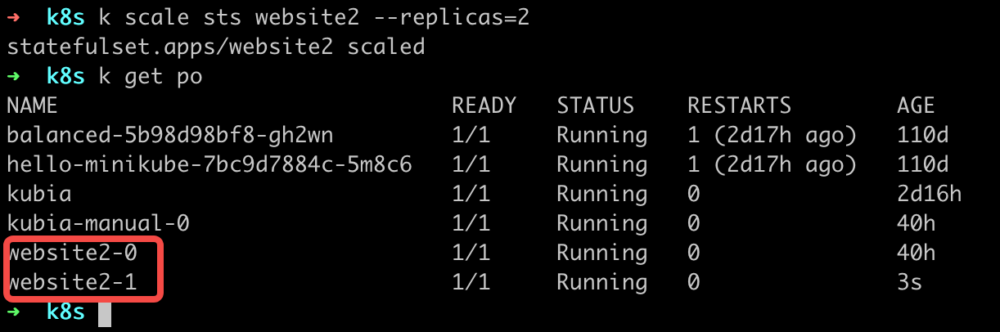
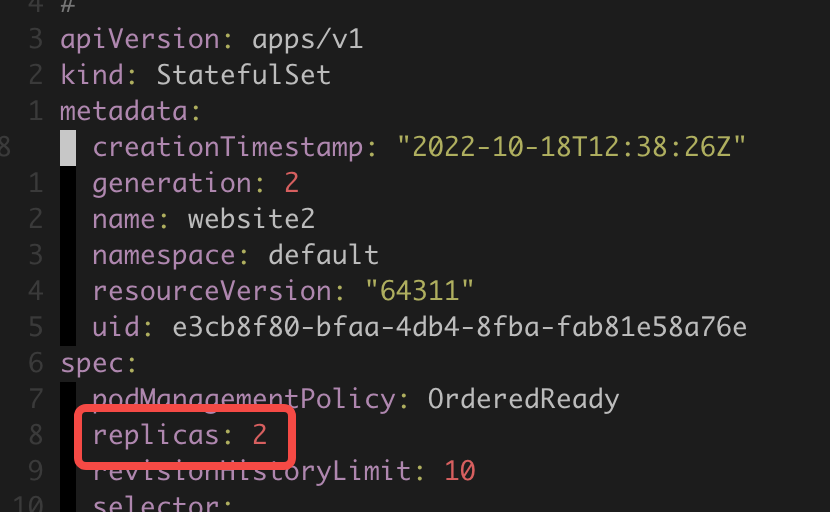
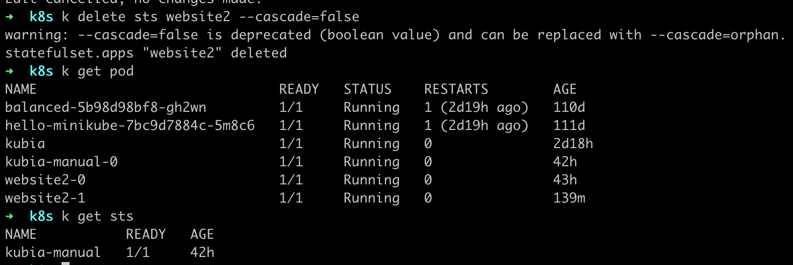
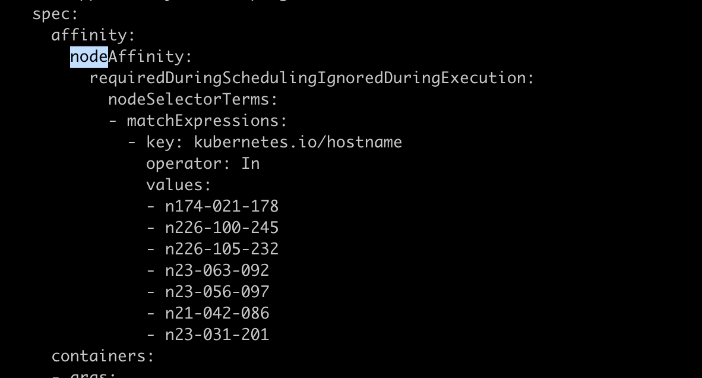
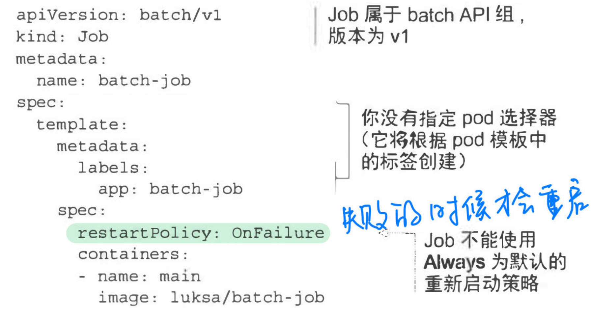
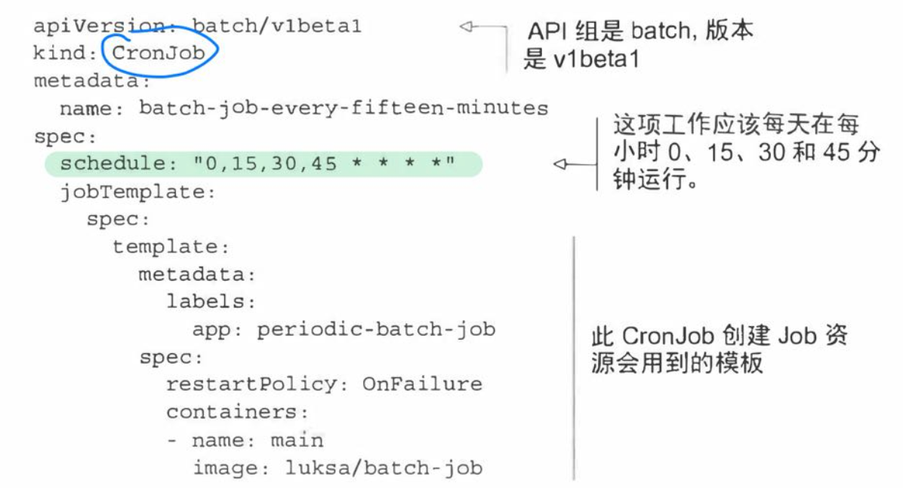

- ## 保持 pod 健康
	- 可以从内部和外部两个方向来保证 pod 的健康
		- 内部：当进程发生崩溃的时候导致 pod 被终止，为了保证服务的正常运行， Kubernetes 会重启新的 pod
		- 外部：通过探针的方式检查当前进程是否正常运行，如果探针检测失败，就会删除失败的 pod，Kubernetes 会重新创建新 pod
-
- ## ReplicationController
	- ReplicationController 是一种 Kubernetes 资源，可确保它的 pod 始终保持运行状态。如果 pod 因为任何原因小时（例如节点从集群中消失或由于该 pod 已从节点驱逐），则 ReplicationController 会注意到缺少了 pod 并创建替代 pod
	- 假如一个节点上有两个 pod：podA 和 podB，podA 是直接创建出来的不被托管在任何控制器上，而 podB 则是由 ReplicationController 管理。此时如果节点异常退出了，ReplicationController 会创建一个新的 podB2 来替换缺少的 podB，而 podA 就完全丢失了。
	-
	- ### ReplicationController 操作
		- ReplicationController 会持续监控正在运行的 pod 列表，**并保证相应“类型”的 pod 数量与期望相符**
		- ReplicationController 不是根据 pod 类型来执行操作的，而是根据 pod 是**否匹配某个标签选择器**
			- ReplicationController 有三个核心部分：
			- <ins style="background: #FFFC79">label selector（标签选择器）</ins> ，用于确定 ReplicationController 作用域中有哪些 pod
				- 只要 ReplicationController 中有一个 selector 能与 pod 中的 label 一致就可以了，pod 中其他的 label 可以作为筛选 pod 的条件存在，也可以发生变化。也就是说，只要 pod 中与 ReplicationController 对应的那个 label 不发生变化，这个 pod 就还是在 ReplicationController 的管辖范围内的。
			- <ins style="background: #FFFC79">replica count（副本数量）</ins>，指定应运行的 pod 数量（期望数量）
			- <ins style="background: #FFFC79">pod template（pod 模版）</ins>，用于创建新的 pod 副本
		- 模版中的 pod 标签必须和 ReplicationController 的标签选择器匹配，否则控制器将无休止地创建新的容器。
			- 我们之前的项目就因为这个导致创了贼多 pod。。。
	-
	- ### 修改 pod 模版
		- ReplicationController 的 pod 模版可以随时修改。注意，当我们修改 pod 模版的时候，如果不删除 pod，它是不会自动重新基于新的 pod 模版创建一个新的 pod，依旧会保留原来的 pod，直到这个 pod 被删除才会重新创建一个新的 pod。
	-
	- ### 水平缩放 pod
		- 我们只需要修改 ReplicationController 的副本数量即可（由于我们这里使用的控制器是 statefulSet，所以我修改 sts 的副本数），可以看到修改副本数为 2 之后，我们的 website 的 pod 也变成两个
		- {:height 189, :width 532}
		- 或者是编辑 sts，修改 spec.replicas 的值:
			- {:height 200, :width 328}
	-
	- ### 删除一个 ReplicationController
		- 当我们通过 `k delete` 删除 ReplicationController 的时候， pod 也会被删除。但是有的时候我们可能想要将 ReplicationController 替换为 ReplicaSet 来管理该 pod，所以就需要只删除 ReplicationController，而保留 pod。
		- 为了实现上面的需求，我们可以在 `k delete` ReplicationController 的时候增加 `--cascade=false` 选项来保持 pod 运行
			- 我理解 statefulSet 和 deployment 都是这样的思路
		- have a try：可以看到 sts 被删了，但是 pod 还保留着
			- {:height 230, :width 668}
	-
-
- ## 使用 ReplicaSet 而不是 ReplicationController
	- ReplicaSet 是 ReplicationController 升级后的 Kubernetes 资源，现在已经将 ReplicationController 废弃了。
	-
	- ### ReplicationController 和 ReplicaSet 的区别
		- 主要区别体现在标签选择器上
			- ReplicationController 只能进行精准匹配，比如我们业务有一个 preload 标签，对于 ReplicationController 而言只能筛选出 preload=0 或 preload=1 的 pod ，没法筛选出 preload in {0, 1} 的 pod
			- ReplicaSet 则运行匹配缺少某个标签的 pod，或包含特定标签的 pod，不管其值如何。
		- ReplicaSet 有四种标签选择运算方式：
			- In：label 的值必须与其中一个指定的 values 匹配
			- NotIn：label 的值与任何指定的 values 不匹配
			- Exists：pod 必须包含一个指定名称的标签（值不重要）。使用此运算符时，不应该指定 values 字段
			- DoesNotExist：pod 不得包含有指定名称的标签。不应该指定 values 字段
		- 如果指定了多个表达式，则所有这些表达式都必须为 true 才能使用选择器与 pod 匹配。
		-
-
- ## 使用 DaemonSet 在每个节点上运行一个 pod
	- 假如此时需要在每个节点上都运行一个 pod 实例，那么可以使用 DaemonSet，这种需求一般包括 pod 执行系统级别的与基础结构相关的操作。例如，希望在每个节点上运行日志收集器和资源监控器。另一个典型的例子就是 Kubernetes 自己的 kube-proxy 进程，它需要运行在所有节点上才能使服务工作。
	- DaemonSet 确保创建足够的 pod，并在自己的节点上部署每个 pod。DaemonSet 没有期望的副本数的概念。**它的工作时确保一个 pod 匹配它的选择器并在每个节点上运行**
		- 不过如果有人将某个节点上的该 pod 删除的时候，它也会重新创建一个新的 pod
	-
	- ### 使用 DaemonSet 在特定的节点上运行 pod
		- 通过 pod 模版中的 nodeSelector 属性指定，这是 DaemonSet 定义的一部分
		- DaemonSet 节点选择器与我们前面提到的节点选择器相似 —— 它定义了 DaemonSet **必须**将其 pod 部署到的节点。
		- ⚠️注意：在后面的章节中，我们会学习到节点可以被设置为不可调度的，防止 pod 被部署到节点上。DaemonSet 甚至会将 pod 部署到这些节点上，因为无法调度的属性只会被调度器使用，<ins>而 DaemonSet 管理的 pod 则完全绕过调度器</ins>。这是预期的，因为 DaemonSet 的目的是运行系统服务，即使是在不可调度的节点上，系统服务通常也是需要运行的。 #tips
		- 如果将 node 的label 修改掉了，那么会将该 pod 从 node 中移除
	-
	- DaemonSet 的创建也是通过 yaml 文件创建，kind 为DaemonSet，apiVersion 为 apps/v1beta2
	-
	- 我们的业务也使用了 DaemonSet —— bytedrive，并且设置了只在其中几个节点上运行
		- {:height 335, :width 623}
		-
	-
-
- ## 运行执行单个任务的 pod
	- 前面讨论了需要持续运行的 pod，也许我们可能有「运行完工作后就终止任务」的需求。前面提到的ReplicationController 、ReplicaSet 以及 DaemonSet 都是会持续运行任务，永远达不到完成态的。这些 pod 中的进程在退出时会重新启动。但是在一个可完成的任务中，其进程终止后，不应该再重新启动。
	-
	- ### Job 资源
		- 利用 job 来管理 pod，我们在通过 yaml 创建 job 的时候应该将 activeDeadlineSeconds 属性设置为 OnFailure 或 Never，如果不设置的话默认为 Always，我们并不需要它总是重新创建 pod，而是只有在失败的时候才重新创建 pod
		- {:height 369, :width 676}
		- job 可以配置 多个 pod 实例，也就是说可以将该 pod 实例执行多次，默认是只执行一次，如果想要执行多次可以通过 completions 参数完成，设置 completions 的数值即表示 pod 实例的执行次数
		- job 既可以串行执行 pod 也可以并行执行 pod，如果想要设置成并行，那么可以通过设置 parallelism 参数来完成，假如将 parallelism 设置为 3，那么就表示当前运行有 3 个 pod 并行执行。
		-
	-
-
- ## 安排 Job 定期运行或在将来运行一次
	- job 资源在创建时会立即运行 pod。但是许多批处理任务需要在特定的时间运行，或者在指定的时间间隔内重复运行。在 Linux 和类 unix 操作系统中，这些任务通常被称为 cron 任务。Kubernetes 也支持这种任务
	- Kubernetes 中的 cron 任务通过创建 CronJob 资源进行配置。 [cron 时间格式](https://cloud.google.com/scheduler/docs/configuring/cron-job-schedules?hl=zh-cn)
	-
	- ### 创建一个 CronJob
		- {:height 310, :width 560}
		-