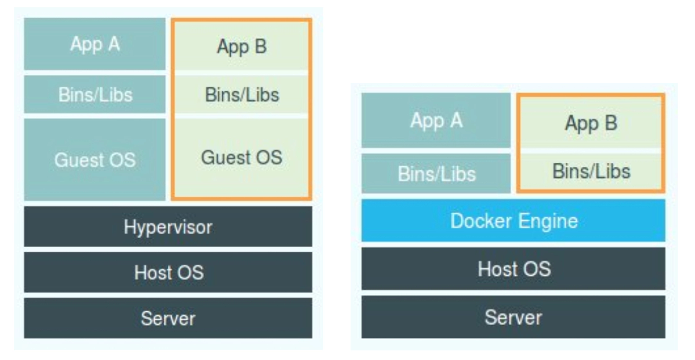
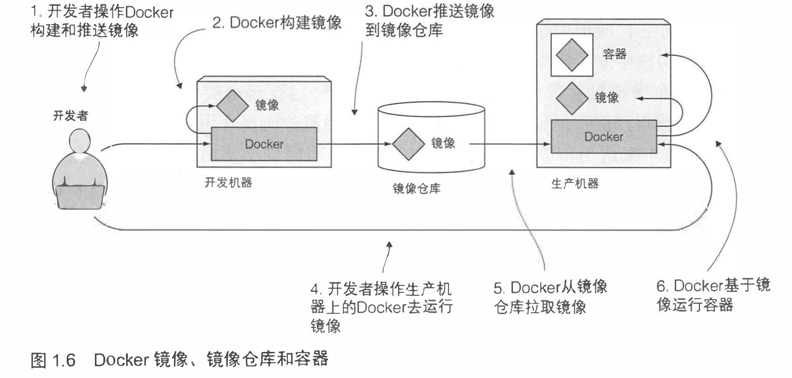
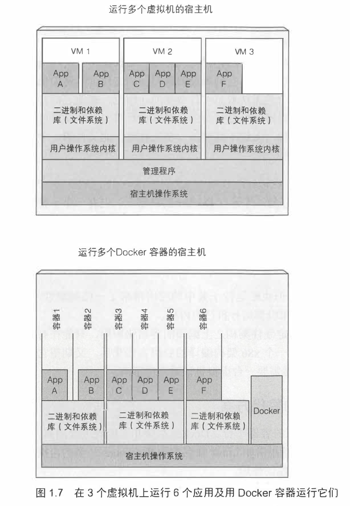

## 容器的发展
	- 容器技术的兴起源于 PaaS 技术的普及；
	- Docker 公司发布的 Docker 项目具有里程碑式的意义；
	- Docker 项目通过“容器镜像”，解决了应用打包这个根本性难题。
-
- <b style="color: red">容器本身没有价值，有价值的是“容器编排”。</b>
-
- ## **容器是什么？**
	- 容器其实是一种沙盒技术。顾名思义，沙盒就是能够像一个集装箱一样，把你的应用“装”起来的技术。这样，应用与应用之间，就因为有了边界而不至于相互干扰；而被装进集装箱的应用，也可以被方便地搬来搬去，这不就是 PaaS 最理想的状态嘛。
-
- ## 容器技术
	- **容器技术的核心功能，就是通过约束和修改进程的动态表现，从而为其创造出一个“边界”。**
	- 对于 Docker 等大多数 Linux 容器来说，**Cgroups 技术**是用来制造约束的主要手段，而 **Namespace 技术**则是用来修改进程视图的主要方法。
	-
	- ### 容器实战
	  collapsed:: true
		- 假设你已经有了一个 Linux 操作系统上的 Docker 项目在运行，比如我的环境是 Ubuntu 16.04 和 Docker CE 18.05。接下来，让我们首先创建一个容器来试试。
		- ```bash
		  $ docker run -it busybox /bin/sh
		  / #
		  ```
			- 上面的指令翻译出来：启动一个容器，在容器里执行 /bin/sh，并且给我分配一个命令行终端跟这个容器交互。
			- 执行完上面指令后，我的 Ubuntu 16.04 机器就变成了一个宿主机，而一个运行着 /bin/sh 的容器，就跑在了这个宿主机里面。而运行的这个 /bin/sh 进程并不能看到容器外的进程，也就是说不能看到宿主上面运行的进程，只能看到在容器中运行的进程，那么这个实际上就利用了 Namespace 机制实现的。
			- Docker 容器这个听起来玄而又玄的概念，实际上是在创建容器进程时，指定了这个进程所需要启用的一组 Namespace 参数。这样，容器就只能“看”到当前 Namespace 所限定的资源、文件、设备、状态，或者配置。而对于宿主机以及其他不相关的程序，它就完全看不到了。
			- <p style="color: red; font-weight: bold">所以说，容器，其实是一种特殊的进程而已。</p>
			-
			-
	-
	- ### Cgroups 和 Namespace 是什么
	  collapsed:: true
		- <span><b style="background: #FF9879">Namespace 机制：</b>它其实只是 Linux 创建新进程的一个可选参数。这个机制能够让容器内的进程与宿主进程进行隔离，让每个进程只能看到自己就的系统视图（文件、进程、网络接口、主机名等）（<del>其实我感觉这个 Namespace 机制有点像是原神里面的尘歌壶，而原神世界就是我们的宿主，尘歌壶就是 docker 容器，我们在尘歌壶内是感知不到外面的世界的，</del>突然发现这个说法不准确，这个例子更像是虚拟机，而不是容器。容器应该是开了一个结界，结界内发生的事情实际上还是在这个世界上发生的，只不过有了这个结界之后，结界内的人并不知道自己实际上是处在一个更大的外部世界中的。这样理解的话，那么 Namespace 机制就是我们画结界的方法）</span>
		  collapsed:: true
			- 有了 Namespace 机制对“视图”进行隔离，但是宿主的资源（CPU、内存）是被宿主本身和容器共享的，所以虽然说 Namespace 让容器和宿主之间实现了隔离，但是并没有真正的完全隔离。为了能够在资源上也实现隔离，于是有了 Cgroups 的概念
			- Linux Namespace 有很多种，这些 Namespace，用来对各种不同的进程上下文进行“障眼法”操作：
				- <span style="background: #FFFB00">Process ID (pid)</span>
				- <span style="background: #FFFB00">Mount (mnt)</span>
				- <span><span style="background: #FFFB00">UTS</span>：决定了运行在命名空间里的进程能看见哪些主机名和域名。通过分派两个不同的 UTS 命名空间给一对进程，能使它们看见不同的本地主机名。换句话说，这两个进程就好像正在两个不同的机器上运行一样（至少就主机名而言是这样的）</span>
				- <span style="background: #FFFB00">Inter-process communication(IPC)</span>
				- <span><span style="background: #FFFB00">Network (net)</span>：决定了运行在进程里的应用程序能看见什么网络接口。每个网路接口属于一个命名空间，但是可以重一个命名空间转移到另一个。每个容器都是用它自己的网络命名空间，因此每个容器仅能够看见它自己的一组网络接口</span>
				- <span style="background: #FFFB00">User ID (user)</span>
			- #problem 上面说到通过 namespace 进行隔离，我们可以给不同的容器分配不同的 主机名/域名/网络接口 之类的，那么这些 主机名/域名/网络接口 是已经存在的吗？
			-
			-
		- <span><b><a style="background: #FF9879; color: #424242" href="https://time.geekbang.org/column/article/14653">Linux Cgroups</a> （Linux Control Group）：Linux 内核中用来为进程设置资源限制的一个重要功能。</b> cgroups 是一个 Linux 内核功能</span>
		  collapsed:: true
			- 它最主要的作用，就是**限制一个进程组能够使用的资源上限，包括 CPU、内存、磁盘、网络带宽等等。** 一个进程的资源使用量不能超出被分配的量。这种方式下，进程不能过分你用为其他进程保留的资源，这和进程运行在不同的机器上是类似的。
			- 在 Linux 中，Cgroups 给用户暴露出来的操作接口是文件系统，即它以**文件和目录的方式**组织在操作系统的 /sys/fs/cgroup 路径下。
			-
	-
		- ### 用 Linux 命名空间隔离进程
			- 默认情况下，每个 linux 系统最初只有一个命名空间。所有系统资源（如文件系统、用户 ID、网络接口等）都属于这个命名空间。但是我们能够创建额外的命名空间，以及在他们之间组织资源。由于 **Linux 中存在很多种类型的多个命名空间，所以一个进程不单单只属于某个命名空间，而属于每个类型的一个命名空间**。
			- 命名空间的种类上面有提到，包括 6 种，**每种命名空间被用来隔离一组特定的资源**。
-
-
- ## 容器和虚拟机的区别
	- {:height 285, :width 473}
	- **虚拟机：**名为 Hypervisor 的软件是虚拟机最主要的部分。它通过硬件虚拟化功能，模拟出了运行一个操作系统需要的各种硬件，比如 CPU、内存、I/O 设备等等。然后，它在这些虚拟的硬件上安装了一个新的操作系统，即 Guest OS。（虚拟机像是原神世界中的尘歌壶）
	- **容器：**则用一个名为 Docker Engine 的软件替换了 Hypervisor。这也是为什么，很多人会把 Docker 项目称为“轻量级”虚拟化技术的原因，实际上就是把虚拟机的概念套在了容器上。**这种说法不严谨**（容器像是人类世界中的结界））
	- 容器并没有一个真正的物理存在的容器在我们的宿主上面运行，而是通过 Namespace 机制做了一些隔离，这个概念感觉有点像是虚拟的虚拟机的概念。因为虚拟机是我们在宿主上面安装了虚拟环境，让进程在这个虚拟环境中运行，而容器则还是在我们的宿主环境中运行，但是运行在容器中的进程并不知道自己在宿主环境中运行。
-
- ## Docker 容器平台
	- **Docker 是一个打包、分发和运行应用程序的平台。**它运行将我们的应用程序和应用程序所依赖的整个环境打包在一起。这既可以是一些应用程序需要的库，也可以是一个被安装的操作系统所有可用的文件。Docker 使得传输这个包到一个中样仓库成为可能，然后这个包就能被分发到任何运行 Docker 的机器上，在那被执行。
	- 三个基本概念
		- _**镜像**_  -- Docker 镜像里包含了我们打包的应用程序以及所依赖的环境。它包含应用程序可用的文件系统和其他元数据，如镜像运行时的可执行文件路径。
		- _**镜像仓库**_ -- Docker 镜像仓库用于存放 Docker 镜像，以及促进不同人和不同电脑之间共享这些镜像。当我们编译我们的镜像时，要么可以在编译它的电脑上运行，要么先上传镜像到一个镜像仓库，然后下载到另一个台电脑上并运行它。某些仓库是公开的，运行所有人从中拉取镜像，同时也有一些事私有的，仅部分人和机器可接入。
		- _**容器**_ -- Docker 容器通常是一个 Linux 容器，它基于 Docker 镜像被创建。一个运行中的容器事一个运行在 Docker 主机上的进程，但它和主机，以及说有运行在主机上的其他进程都是隔离的。这个进程也是资源受限的，意味着它只能访问和使用分配给它的资源（CPU、内存等）
	-
	- ### 构建、分发和运行 Docker 容器
		- 如下图所示，展示了上面介绍的三个概念以及它们之间的关系：开发人员首先构建一个镜像，然后把镜像推到镜像仓库中。因此任何可以访问镜像仓库的人都可以使用该镜像。然后，他们可以将镜像拉取到任何运行着 Docker 的机器上运行镜像。Docker 会基于镜像创建一个独立的容器，并运行二进制可执行文件指定其作为镜像的一部分。
			- {:height 364, :width 764}
		-
	- ### 对比虚拟机和 Docker 容器
		- 对比相同 6 个应用程序分别运行在虚拟机上和用 Docker 容器运行
			- {:height 421, :width 271}
		- 每个容器都有它自己隔离的文件系统，应用 A 和应用 B 是如何共享同样的文件的呢？
		-
		- #### 镜像层
			- Docker 镜像是由多层构成。不同镜像可能包含完全相同的层，因为这些 Docker 镜像都是基于另一个镜像之上构建的。
			- Docker 镜像的多层设计有两个优点：
				- 1. **提升镜像在网络上的分发效率。**当传输某个镜像时，因为相同的层已经被之前的镜像传输，那这些层就不需要再被传输；
				  2. **减少镜像的存储空间。**每一层仅被存储一次，当基于相同基础层镜像被创建成两个容器时，它们能够读相同的文件。但是如果其中一个容器写入某些文件，另一个是无法看见文件变更的。因此，即使它们共享文件，仍然彼此隔离。 <ins>这是因为容器镜像层是只读的</ins>
-
- # 总结
	- **一个正在运行的 Docker 容器，其实就是一个启用了多个 Linux Namespace 的应用进程**，而这个进程能够使用的资源量，则受 Cgroups 配置的限制。也就是说容器的隔离从视图和资源两个维度进行，分别采用 namespace 和 cgroups 技术实现
	- **容器是一个“单进程”模型**：容器是『单进程』模型，只有 PID=1 的进程才会被 Dockerd 控制，即 pid=1 的进程挂了 Docker 能够感知到，但是其它的进程却不受 Dockerd 的管理，当出现孤儿进程的时候，管理和调度是个问题
		- 由于一个容器的本质就是一个进程，用户的应用进程实际上就是容器里 PID=1 的进程，也是其他后续创建的所有进程的父进程。这就意味着，在一个容器中，你没办法同时运行两个不同的应用，除非你能事先找到一个公共的 PID=1 的程序来充当两个不同应用的父进程，这也是为什么很多人都会用 systemd 或者 supervisord 这样的软件来代替应用本身作为容器的启动进程。
-
-
- ## Reference
- 【1】[https://time.geekbang.org/column/article/14642](https://time.geekbang.org/column/article/14642)
- 【2】 [Linux Namespace](https://coolshell.cn/articles/17010.html)
- 【3】 [Linux 进程](https://linux.cn/article-8451-1.html)
-
-