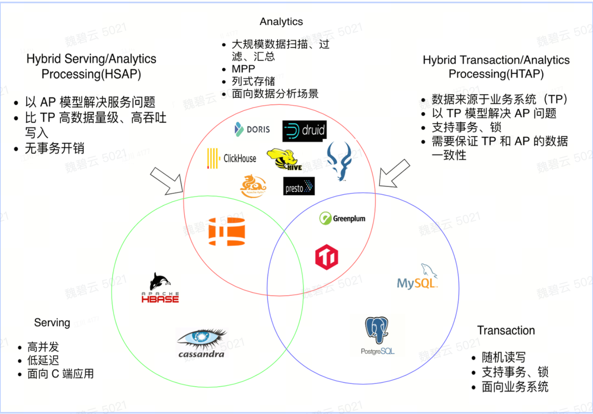

- #+BEGIN_VERSE
  **tags:**  #数仓 #数据库
  #+END_VERSE
-
-
- ## 数仓是什么？
	- **定义：**Data Warehouse，也成为企业数据仓库。数据仓库是一个大型的数据存储系统，主要用于储存、查询和分析企业的历史数据。数据仓库是商业智能应用的重要组成部分，它可以帮助公司了解业务过去的行为，并促进更好的决策。
-
- ### 什么是预计算数仓？
	- 预计算数据仓库主要是指那些**通过预计算和存储常用查询或聚合结果**，以提供更快查询性能的数据仓库系统。
	- 预计算数据仓库的核心能力在于它能够**预先计算并存储经常被查询或计算的数据结果，进而提高查询速度和效率。**
	- 预计算数仓包含：
		- Clickhouse
		- Druid
		- Kylin
-
- ### 宽表和多表
  collapsed:: true
	- 当我们在建立数据仓库的时候，关于数据的存储和建模，有两种常见的方法：**宽表模型**（或扁平模型）和**多表组合模型**（或星型模型、雪花模型）。
		- **宽表模型**：宽表模型是将所有相关数据存储在一个大表中，每个字段是一列，每个数据记录是一行。这种模型可以减少表间的关联查询，节省查询时间，提高查询性能。然而，由于所有数据都存储在一张表里，这可能导致某些字段有大量的空值，从而造成存储的浪费。
		- **示例**：例如，对于一个电商公司，它们可能有一个"sales"宽表，包含每一个订单的所有信息，比如订单ID、用户ID、产品ID、购买时间、产品类别、价格、折扣等所有相关的列。
	- -
		- **多表组合模型**：一种常见的多表组合模型是星型模型，它使用多个表来存储数据，包含一个事实表和多个维度表。事实表包含业务过程数据（通常是数值型的度量），维度表则包含描述性的属性。在查询过程中需要关联多个表。
		- **示例**：在上述电商公司的例子中，星型模型可能包含一个"sales"事实表，存储订单ID、用户ID、产品ID、购买时间等事实信息，以及"Product"维度表，包含产品ID、产品类别、价格；"Customer"维度表，包含用户ID、用户名称、用户地区等。
	- 在选择使用哪种模型时，需要根据具体的应用场景和需求进行权衡。在需要执行复杂查询与分析的数据仓库场景中，多表组合模型常被优先选择，因为其结构化的特点可以使得数据更易于理解和使用。而在需要快速查询而可以接受一定存储冗余的大数据场景下，则可能更适合使用宽表模型，以减少计算机从多个表中提取数据的复杂度。
-
-
- ### 列存储 和 行存储
  collapsed:: true
	- 行查询和列查询的区别主要在于数据的组织和访问方式。理解这个概念可以帮我们更好地理解数据库如何存储和检索数据。
	-
	- **行查询**：在基于行的数据库系统中，数据被组织并存储为一系列行，同一列的数据存储在连续的存储空间中。当执行查询时，数据库会按行访问数据。这种方式非常适用于 OLTP（在线事务处理）场景，如插入、删除和更新操作，因为它们通常只涉及少数几行中的多个字段。
	- 例如，假设我们有一个员工数据库表，每个员工作为一行。如果我们想更新一个员工的信息（例如，他们的地址和电话号码），行存储可以快速找到该行，并更新必要的信息。
hello

	-
	- **列查询**：在基于列的数据库系统（或列存储）中，数据按列组织和存储，同一列的数据存储在连续的存储空间中。当执行查询时，数据库会按列访问数据。这种方式非常适用于 OLAP（在线分析处理）场景，如大量数据的汇总、复杂查询等，因为它们通常需要访问几个列但只涉及少数行。
	- 例如，如果我们想计算整个员工表中所有员工的平均工资，列存储可以在查询中快速访问“工资”列，而无需加载表中的其他数据。
	-
	- 因此，行存储和列存储性能上的主要区别在于他们要执行的主要工作负载。例如，关系数据库管理系统（例如 MySQL，PostgreSQL）主要考虑事务处理（即行查询），而数据仓库解决方案（例如 Redshift，BigQuery）主要考虑数据分析负载（即列查询）。
	-
	- 在某些场景下，列存储的 I/O 速度可能更快，例如：
		- 批量数据加载：当需要将大量数据加载到数据库中时，列存储可以一次性将某一列的数据加载到内存中，然后再批量写入磁盘。相比之下，行存储可能需要多次随机访问磁盘来加载完整的行数据，导致 I/O 开销更大。
		- 数据压缩：列存储通常支持更高效的数据压缩算法，因为同一列中的数据具有较高的相似性。通过压缩数据，可以减少 I/O 传输的数据量，从而提高 I/O 速度。
		- 列查询和分析：在进行针对某一列或少数几列的查询和分析时，列存储可以只读取相关列的数据，避免读取不需要的行数据。这样可以减少 I/O 操作次数和数据传输量，提高查询性能。
	- 需要注意的是，选择行存储还是列存储取决于具体的应用场景和需求。行存储在更新和插入操作上通常更高效，而列存储在大规模数据查询和分析方面可能更具优势。因此，在选择存储方式时，需要综合考虑性能、数据访问模式和维护成本等因素。
-
- ## 数仓和数据库的区别是什么？
  collapsed:: true
	- 
-
- ## 数仓分类
  collapsed:: true
	- 
-
-
- ## 各类数仓说明
- ### Hive：
	- Apache Hive 是可实现大规模分析的分布式容错数据仓库系统。该数据仓库集中存储信息，您可以轻松对此类信息进行分析，从而做出明智的数据驱动决策。Hive 让用户可以利用 SQL 读取、写入和管理 PB 级数据。
	- 用户使用类似于 SQL 的查询语言进行数据操作，但 Hive 在执行查询时需要将查询转换为MapReduce任务，查询速度较慢。
	- Hive 支持存储在 Hadoop Distributed File System (HDFS) 中的各种数据格式，并能处理 PB 级别的大规模数据集。它支持 MapReduce、Tez 和 Spark 等多种执行引擎。
- ### **ClickHouse**：
	- 公司基于开源的 ClickHouse 做了优化
	- 列式存储 和 MPP（大规模并行处理）提供高性能的实时查询
	- 使用类似 SQL 的查询语言
- ### **Doris**：
-
- ## BI 平台
- ### **TEA**：
  collapsed:: true
	- TEA（行为分析系统），是字节内一款基于用户行为数据打造的数据中台产品，为字节内部抖音、头条、西瓜、TikTok 等国内外各类业务提供数据分析服务，具备支撑EB级海量数据、万亿级事件量、秒级响应的强大性能，为用户提供简单灵活高性能的数据分析服务。
	- 
	- TEA 的数仓选型，选的也是 ClickHouse。不过看最近的文档，说是外接的 hive 表。看起来最终的选型定位了 Hive
		- 
		- 
		-
- ### **风神**：
  collapsed:: true
	- 这个并不是 数据仓库，而是 BI 平台，只能将对数据仓库中的数据进行可视化等处理（见文档，可看到它对不同数据源的支持程度： https://aeolus.arcosite.bytedance.net/2060/30693）
	- {:height 370, :width 748}
-
- ByteHTAP和ClickHouse的性能对比怎么样？
  background-color:: yellow
	- #+BEGIN_VERSE
	  [ByteHTAP Alpha Release Notes](https://bytedance.larkoffice.com/docs/doccnJC7ihR8btrEDXbJnLpkdQf?bk_entity_id=enterprise_51325724)
	  #+END_VERSE
	- ByteHTAP和ClickHouse并不是完全对等的系统，如果要比较的话，单从AP对比较为合适。ClickHouse的设计出发点是追求极致性能，所以在设计上做了很多取舍，导致缺点也比较明显：如不支持事务，查询并发不高，写入需要尽量攒批，导致实时性不好，不支持全部sql语法，分布式Join支持不好等等。ByteHTAP的 AP 较 ClickHouse 的优势在于：支持实时查询，支持事务，AP query支持复杂语法，支持灵活的DDL等。
-
- 如何选择是否使用 Doris？
  background-color:: yellow
	- #+BEGIN_VERSE
	  [2021直播嘉年华数据团队在存储引擎上的选择(ClickHouse/Doris)](https://bytedance.larkoffice.com/docx/doxcn5fOopE8wFGwhw3xYrPRJhd)
	  #+END_VERSE
	- {:height 589, :width 749}
-
-
- 确认关注点：
  background-color:: green
	- background-color:: gray
	  > 对于 query 分析而言，主要需要关心数据的哪些属性，通过分析当前业界与公司的相关数仓，匹配我们所需满足的条件，找出最适合的数仓进行数据存储和分析
	- 下面参考 aPaaS 对齐的目标
	- 是否需要可视化
	  logseq.order-list-type:: number
	- 数据量
	  logseq.order-list-type:: number
	- 并发：目前线上并发低于 1 QPS。中期来看，目标是支持 100 QPS 的并发度。
	  logseq.order-list-type:: number
	- 事务：数据来自业务系统（可能会经过一层处理转换），Nice to have
	  logseq.order-list-type:: number
	- 响应时间：秒级、毫秒级
	  logseq.order-list-type:: number
	- 数据模型：维度不固定；条件复杂（Join、层级递归查询）
	  logseq.order-list-type:: number
-
- 调研方向：
  background-color:: green
	- 数仓的类型
	  logseq.order-list-type:: number
	- 各个类型的数仓有哪些（归纳总结）
	  logseq.order-list-type:: number
	- 各个数仓的优缺点
	  logseq.order-list-type:: number
	- 数仓的接入方式
	  logseq.order-list-type:: number
	- 适用场景和非适用场景
	  logseq.order-list-type:: number
-
- 可参考文档：
	- [数仓选型](https://bytedance.larkoffice.com/wiki/wikcn6muD4n0s8S7fH3xfpyyjpb)
-
- ## 名词解释
  collapsed:: true
	- |术语|解释|
	  |--|--|
	  |TP（Transaction Processing，事务处理）|TP 系统用来处理、管理和监控执行日常业务操作的事务。它们强调快速、可靠地处理类似创建、读取、更新、删除的操作。其中 OLTP（OnLine Transaction Processing，联机事务处理）是最常见类型，能高效处理大量短期在线事务。|
	  |AP（Analytical Processing，分析处理）|AP 系统用来分析和支持决策过程。它们通常用于多维分析查询，如趋势分析、聚合、分组等复杂查询。其中 OLAP（OnLine Analytical Processing，联机分析处理）是 AP 的一种类型，强调在大规模、复杂数据上支持复杂分析查询。|
	  |HTAP（Hybrid Transactional/Analytical Processing，混合事务/分析处理）|HTAP 系统和解决方案旨在同时处理 TP 和 AP 工作负载，结合了事务处理的操作和分析查询的处理。HTAP 核心价值在于减少数据复制和移动，处理实时或近实时的业务情况，并且能够在同一系统中支持 OLTP 和 OLAP。|
	  |HSAP（Hybrid Serving & Analytical Processing / 服务分析一体化）|HSAP 是一种混合在线服务（Serving）和实时分析（Analytical）业务，具备同时解决这种两种问题能力的一种新兴的应用体系结构，又叫服务分析一体化。[:br][:br]Krypton 是字节基础架构 计算-实时引擎，创新应用中心，存储 -HDFS & NoSQL 团队共同合作研发的新一代面向复杂业务场景的实时服务分析 HSAP (Hybrid Serving & Analytical Processing) 系统。|
-
-