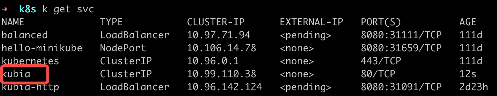
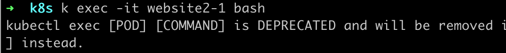
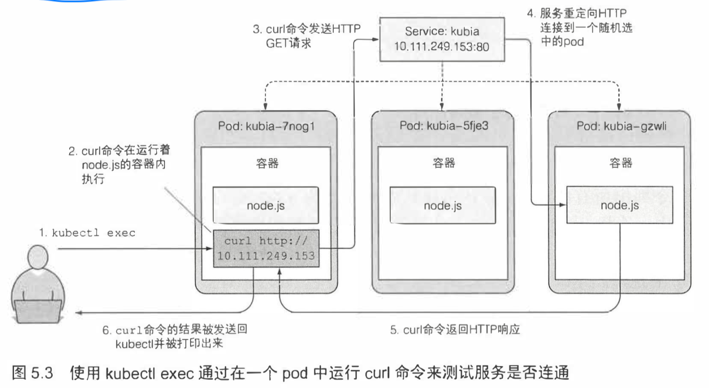
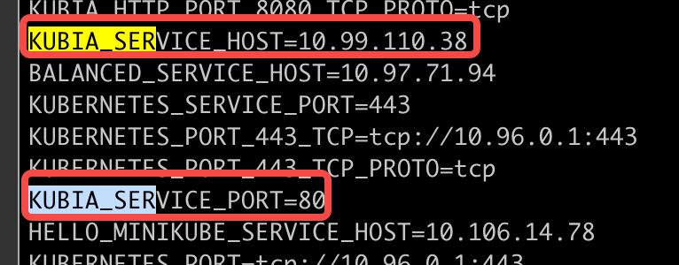

- ## 介绍服务
	- ### 创建服务
		- 利用 yaml 创建 service
			- ```yaml
			  apiVersion: v1
			  kind: Service
			  metadata:
			    name: kubia
			  spec:
			    ports:
			    - port: 80	// 该服务的可用端口
			      targetPort: 8080  // 服务将连接转发到的容器端口
			    selector:
			      app: kubia	// 具有 app=kubia 标签的 pod 都属于该服务
			  ```
			-
		- 创建 service
			- ```bash
			  k create -f kubia-svc.yaml
			  ```
			- {:height 131, :width 725}
			- 可以看到分配给服务的 IP 地址是 10.99.110.38。由于这个是集群的 IP 地址，只能在集群内可以被访问。但是有时候我们也希望能够对外暴露服务。
	-
	- ### 内部集群测试服务
	  collapsed:: true
		- 有几种方式能实现：
			- 创建一个 pod，这个 pod 容器中的进程去给 kubia 发消息，查看日志
			- 使用 ssh 登录到 Kubernetes 中另一个节点，使用 curl 发请求
			- 使用 `k exec` 进入到其他的 pod 中执行 curl 命令
				- 进入容器中执行
					- {:height 64, :width 533}
					- {:height 53, :width 540}
				- 远程执行
					- {:height 59, :width 539}
					- `--` 表示 kubectl 命令项的结束。在两个横杠之后的内容是指在 pod 内部需要执行的命令。如果需要执行的命令么有以横杠开始的参数（比如这里有 `-s`），那么双横杠（`--`）也不是必需的。因为如果不使用`--`，`-s`选项会被解析成 k exec 选项，因此导致歧义
					- `-s` 告诉 kubetcl 需要链接一个不同的 API 服务而不是默认的
	-
	- ### 在运行的容器中远程执行命令
	  collapsed:: true
		- 执行 `k exec website2-1 -- curl -s 10.99.110.38:80` 的内部处理流程如下图
			- {:height 403, :width 725}
	-
	- ### 配置服务上的会话亲和性
	  collapsed:: true
		- 如果多次执行同样的命令，每次调用执行应该在不同的 pod 上。因为服务代理通常将每个连接随机指向选中的后端 pod 中的一个，即使连接来自于同一个客户端。
		- 如果想要将每次请求都指向同一个 pod，可以设置服务的 sessionAffinity 属性为 ClientIP。（默认为 None）
		- Kubernetes 仅支持两种形式的会话亲和性服务：None 和 ClientIP
	-
	- ### 同一个服务暴露多个端口
	  collapsed:: true
		- 创建的服务可以暴露一个端口，也可以暴露多个端口。假如我们的 pod 监听两个端口（http监听 8080、https 监听8443），可以使用一个服务从端口 80 和 443 转发至 pod 端口 8080 和 8443。这样，我们就能够不创建两个服务，通过一个集群 IP，使用一个服务就能将多个端口暴露出来了。
		- yaml 文件配置方式
			- <ins style="background: #9DFAA6">在创建一个有多个端口的服务的时候，必须给每个端口指定名字</ins>
			- ```yaml
			  apiVersion: v1
			  kind: Service
			  metadata:
			    name: kubia
			  spec:
			    ports:
			    - name: http	// 端口名字
			    	port: 80	// 该服务的可用端口
			      targetPort: 8080  // 服务将连接转发到的容器端口
			    - name: https
			    	port: 43	
			      targetPort: 8443  
			    selector:
			      app: kubia	// 具有 app=kubia 标签的 pod 都属于该服务
			  ```
		-
		- 我们可以给 pod 的端口命名，服务在指向 targetPort 的时候直接采用命名的端口即可
			- pod 的 yaml
				- ```yaml
				  Kind: Pod
				  spec:
				    containers:
				    -	name: kubia
				      port:
				      - name: http			// 8080 端口被命名为 http
				  	  containerPort: 8080
				     	- name: https			// 8443 端口被命名为 https
				        containerPort: 8443
				  ```
			- service 的yaml
				- ```yaml
				  apiVersion: v1
				  kind: Service
				  metadata:
				    name: kubia
				  spec:
				    ports:
				    - name: http	
				    	port: 80	
				      targetPort: http  // 使用命名
				    - name: https
				    	port: 43	
				      targetPort: https  
				    selector:
				      app: kubia	// 具有 app=kubia 标签的 pod 都属于该服务
				  ```
			-
			- 使用命名的优点：**更换端口号也不需要改服务的 spec**
	-
	- ### 服务发现
	  collapsed:: true
		- 通过环境变量：
			- ```bash
			  k exec podName env
			  ```
			- 如果 pod 在 service 之前创建，那么我们通过上面的方式是没法查到当前 pod 的环境变量的，如果想要拿到当前 pod 的环境变量就必须删除当前 pod 重新创建一个
				- {:height 162, :width 453}
				- 上面两个环境变量分别表示**集群的 IP 和服务的端口号**，有了这两个，集群内的 pod 就能访问该 pod 了。
					- 我想说，这个不就是通过 `k get svc podName -o wide` 就能看到的信息吗，干嘛搞这么麻烦
					-
		-
		- 通过 dns
			-
		-
		- 在 pod 容器中运行 shell
			- ```bash
			  k exec -it podName bash
			  ```
		-
		- 无法 ping 通服务 IP 的原因
			- 当我们尝试 ping 服务的时候会发现 ping 不同，但是 curl 又是能够工作的，这是为啥呢？
			- 这是因为服务的集群 IP 是一个虚拟 IP，并且只有在与服务端口结合时才有意义。
-
- 连接集群外部的服务
- 将服务暴露给外部客户端
- 通过 Ingress 暴露服务
- pod 就绪后发出信号
- 使用 headless 服务来发现独立的 pod
- 排除服务故障