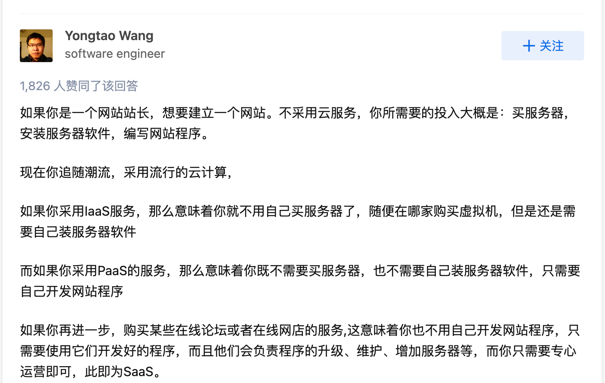

- ## Iaas、Paas、Saas
	- IaaS（Infrastructure as a service – 基础设施即服务）
	- PaaS（Platform as a service – 平台即服务）
	- SaaS（Software as a Service – 软件即服务）
	- [参考](https://www.zhihu.com/question/20387284)
	- 
-
- ## Quota
	- 资源配置，比如分配个每个工作区的资源是 4c12g 128g ，这个分配的资源就是 quota 的概念