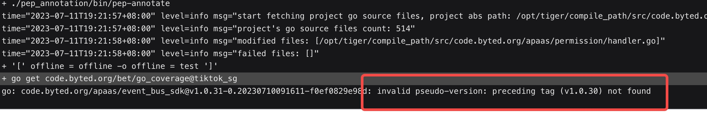

- ## 7.11
- 
permission 依赖的 event_bus_sdk 版本不对，导致编译不过。
 <b>这个问题是由于 event_bus_sdk 被别人乱打了一个版本，我当时拉的是哪个版本，后来这个版本被删掉了导致依赖不正确，这个其实清一下缓存就可以处理了</b>
	- 
-
-
- ## 7.12
- 测试发现 pkg 那边改了获取生产环境 changeUnit 的部分逻辑（将 ctx 转成了生产环境），之前这部分逻辑我在下游服务做的，由于 pkg 做了这部分逻辑导致我那部分会报错，今天改了一下这部分的代码。
- 由上面的问题引起了另一个问题，之前使用沙箱环境的 ctx 的时候是能够正确获取到 object 和 dataset 的数据的，但是当它转换成线上的 ctx 之后就获取不到了，因为 id 的沙箱的 id，这部分逻辑今天才暴露出问题，今天晚上改了半天（主要是太复杂了，担心改出问题来）